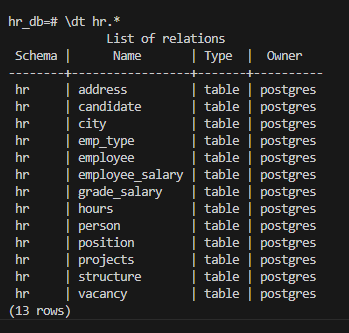
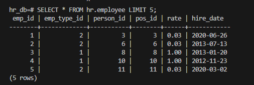

-- ================================================
-- Задание 1. Работа с командной строкой
-- ================================================

-- Задание 1.1: Создание новой базы данных (выполняется в командной строке)

```bash
createdb hr_db -U postgres 
```

-- Задание 1.2: Восстановление бэкапа (выполняется в командной строке)
```bash
psql -d hr_db -U postgres -h localhost -p 5432 -f hr.sql
```

-- 1.3. Выведите список всех таблиц восстановленной базы данных

-- Подключение
```psql
psql -d hr_db -U postgres -h localhost -p 5432
```

-- Вывести список всех таблиц
```sql
\dt hr.*
```


1.4. Выполните SQL-запрос на выборку всех полей из любой таблицы восстановленной базы данных
```sql
SELECT * FROM hr.employee LIMIT 5; 
```


-- ================================================
-- Задание 2. Работа с пользователями
-- ================================================

-- Задание 2.1: Создание пользователя MyUser
```sql
CREATE USER "MyUser" WITH LOGIN;
```

-- Задание 2.2: Установка пароля с ограничением по сроку

-- Меняйте дату на актуальную (пример для мая 2024)
```sql
ALTER USER "MyUser" 
WITH PASSWORD '8961' 
VALID UNTIL '2025-12-31';
```


-- Задание 2.3: Предоставление прав на чтение
```sql
GRANT SELECT ON TABLE employees TO "MyUser";
GRANT SELECT ON TABLE departments TO "MyUser";
```

-- Задание 2.4: Отзыв прав на чтение
```sql
REVOKE SELECT ON TABLE employees FROM "MyUser";
REVOKE SELECT ON TABLE departments FROM "MyUser";
```
-- Задание 2.5: Удаление пользователя
```sql
DROP USER "MyUser";
```

-- ================================================
-- Задание 3: Работа с транзакциями
-- ================================================

-- 3.1. Начните транзакцию
```sql
BEGIN;
```
-- 3.2: Добавление новой записи в таблицу projects
```sql
INSERT INTO projects (project_id, project_name, start_date, end_date)
VALUES (9999, 'Test Project', CURRENT_DATE, CURRENT_DATE + INTERVAL '30 days');
```
-- 3.3: Создание точки сохранения
```sql
SAVEPOINT insert_project;
```
-- 3.4: Удаление добавленной записи
```sql
DELETE FROM projects WHERE project_id = 9999;
```

-- 3.5: Откат к точке сохранения
```sql
ROLLBACK TO SAVEPOINT insert_project;
```
-- 3.6: Фиксация изменений
```sql
COMMIT;
```