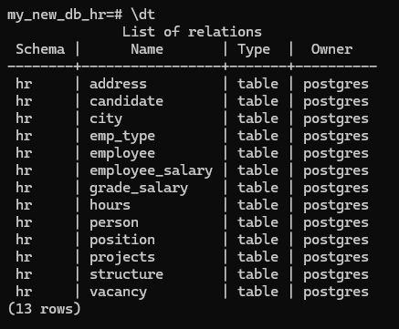

-- task 1
CREATE DATABASE my_new_db_hr;

pg_dump -h localhost -p 5433 -U postgres -d my_new_db_hr -f hr.sql

psql -h localhost -p 5433 -U postgres -d my_new_db_hr

SET search_path TO hr, public;

\dt

SET search_path TO hr, public;

SELECT * FROM address;

-- task 2

CREATE USER myuser WITH LOGIN;

ALTER USER myuser WITH PASSWORD '1234' VALID UNTIL '2025-09-30';

GRANT SELECT, UPDATE ON TABLE hr.address, hr.candidate TO myuser;

REVOKE SELECT, UPDATE ON TABLE hr.address, hr.candidate to myuser;

DROP USER myuser;

-- task 3
SET search_path TO public;

BEGIN;

CREATE TABLE projects (
    id SERIAL,
    name VARCHAR(100)
);

INSERT INTO projects (name)
VALUES ('Alpha');

SAVEPOINT sp1;

DELETE FROM projects WHERE name = 'Alpha';

ROLLBACK TO SAVEPOINT sp1;

COMMIT;

SELECT * FROM projects WHERE name = 'Alpha';