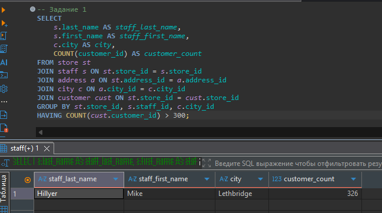
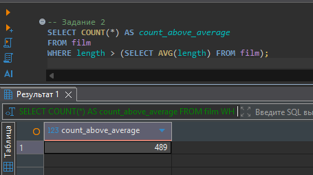
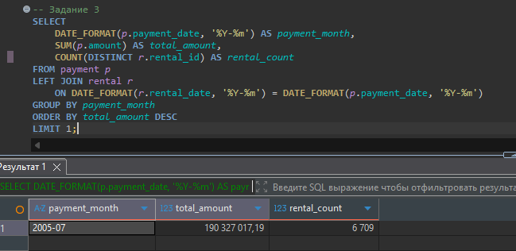
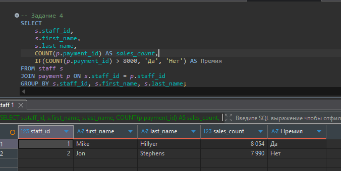
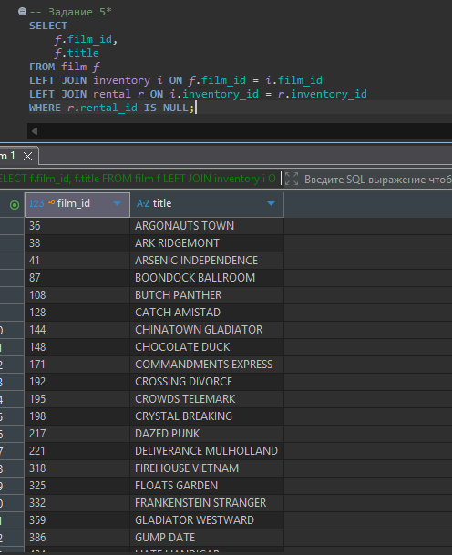

# Домашнее задание к занятию "SQL. Часть 2" - `Конкин Дмитрий`

Задание 1
Одним запросом получите информацию о магазине, в котором обслуживается более 300 покупателей, и выведите в результат следующую информацию:

фамилия и имя сотрудника из этого магазина;
город нахождения магазина;
количество пользователей, закреплённых в этом магазине.
```sql
SELECT
    s.last_name AS staff_last_name,
    s.first_name AS staff_first_name,
    c.city AS city,
    COUNT(customer_id) AS customer_count
FROM store st
JOIN staff s ON st.store_id = s.store_id
JOIN address a ON st.address_id = a.address_id
JOIN city c ON a.city_id = c.city_id
JOIN customer cust ON st.store_id = cust.store_id
GROUP BY st.store_id, s.staff_id, c.city_id
HAVING COUNT(cust.customer_id) > 300;
```

Задание 2
Получите количество фильмов, продолжительность которых больше средней продолжительности всех фильмов.
```sql
SELECT COUNT(*) AS count_above_average
FROM film
WHERE length > (SELECT AVG(length) FROM film);
```


Задание 3
Получите информацию, за какой месяц была получена наибольшая сумма платежей, и добавьте информацию по количеству аренд за этот месяц.

Дополнительные задания (со звёздочкой*)
Эти задания дополнительные, то есть не обязательные к выполнению, и никак не повлияют на получение вами зачёта по этому домашнему заданию. Вы можете их выполнить, если хотите глубже шире разобраться в материале.
```sql
SELECT
    DATE_FORMAT(p.payment_date, '%Y-%m') AS payment_month,
    SUM(p.amount) AS total_amount,
    COUNT(DISTINCT r.rental_id) AS rental_count
FROM payment p
LEFT JOIN rental r
    ON DATE_FORMAT(r.rental_date, '%Y-%m') = DATE_FORMAT(p.payment_date, '%Y-%m')
GROUP BY payment_month
ORDER BY total_amount DESC
LIMIT 1;

--
```


Задание 4*
Посчитайте количество продаж, выполненных каждым продавцом. Добавьте вычисляемую колонку «Премия». Если количество продаж превышает 8000, то значение в колонке будет «Да», иначе должно быть значение «Нет».
```sql
SELECT
    s.staff_id,
    s.first_name,
    s.last_name,
    COUNT(p.payment_id) AS sales_count,
    IF(COUNT(p.payment_id) > 8000, 'Да', 'Нет') AS Премия
FROM staff s
JOIN payment p ON s.staff_id = p.staff_id
GROUP BY s.staff_id, s.first_name, s.last_name;
```


Задание 5*
Найдите фильмы, которые ни разу не брали в аренду.
```sql
SELECT
    f.film_id,
    f.title
FROM film f
LEFT JOIN inventory i ON f.film_id = i.film_id
LEFT JOIN rental r ON i.inventory_id = r.inventory_id
WHERE r.rental_id IS NULL;
```

