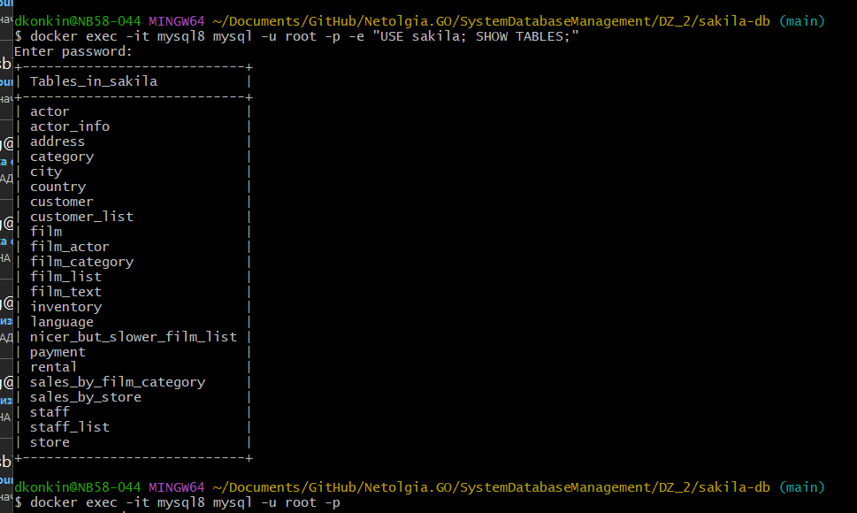

# Домашнее задание к занятию "`Работа с данными (DDL/DML)`" - `Конкин Дмитрий`

1.1. Поднимите чистый инстанс MySQL версии 8.0+ + Docker.

```
docker run -d --name mysql8 -e MYSQL_ROOT_PASSWORD=password -p 3306:3306 mysql:8.0
```

1.2. Создайте учётную запись sys_temp.
```
docker exec -it mysql8 mysql -u root -p
```
Создание пользователя sys_temp
```
CREATE USER 'sys_temp'@'%' IDENTIFIED BY 'password';
```

1.3. Выполните запрос на получение списка пользователей в базе данных. (скриншот)
```SQL
SELECT User, Host FROM mysql.user;
```


1.4. Дайте все права для пользователя sys_temp.
```sql
GRANT ALL PRIVILEGES ON *.* TO 'sys_temp'@'%';
FLUSH PRIVILEGES;
```

1.5. Выполните запрос на получение списка прав для пользователя sys_temp. (скриншот)

```sql
SHOW GRANTS FOR 'sys_temp'@'%'\G
```


1.6. Переподключитесь к базе данных от имени sys_temp.

Для смены типа аутентификации с sha2 используйте запрос:
```sql
ALTER USER 'sys_temp'@'%' IDENTIFIED WITH mysql_native_password BY 'password';
```
Выход и повторное подключение:
```
exit
```
```
docker exec -it mysql8 mysql -u sys_temp -p
```

1.7. По ссылке https://downloads.mysql.com/docs/sakila-db.zip скачайте дамп базы данных.

1.7. Восстановите дамп в базу данных.

Копирование файлов в контейнер
```
docker cp sakila-schema.sql mysql8:/tmp/
docker cp sakila-data.sql mysql8:/tmp/
```

Создание базы данных sakila
```
$ docker exec -it mysql8 mysql -u root -p -e "SHOW DATABASES;"
```

Загрузка схемы и данных
```
docker exec -i mysql8 mysql -u root -ppassword sakila < sakila-schema.sql
docker exec -i mysql8 mysql -u root -ppassword sakila < sakila-data.sql
```
1.8. Получения всех таблиц базы данных. (скриншот)|
```
$ docker exec -it mysql8 mysql -u root -p -e "USE sakila; SHOW TABLES;"
```


Задание 2
Составьте таблицу, в которой должно быть два столбца: 
- в первом должны быть названия таблиц восстановленной базы, 
- во втором названия первичных ключей этих таблиц.
```
SELECT 
    TABLE_NAME AS 'Tabls',
    COLUMN_NAME AS 'PK'
FROM 
    INFORMATION_SCHEMA.KEY_COLUMN_USAGE
WHERE 
    TABLE_SCHEMA = 'sakila'
    AND CONSTRAINT_NAME = 'PRIMARY'
ORDER BY 
    TABLE_NAME;
```


Задание 3*
3.1. Уберите у пользователя sys_temp права на внесение, изменение и удаление данных из базы sakila.
```
REVOKE ALL PRIVILEGES, GRANT OPTION FROM 'sys_temp'@'%';
FLUSH PRIVILEGES;
```

3.2. Выполните запрос на получение списка прав для пользователя sys_temp. (скриншот)
```
SHOW GRANTS FOR 'sys_temp'@'%';
```
