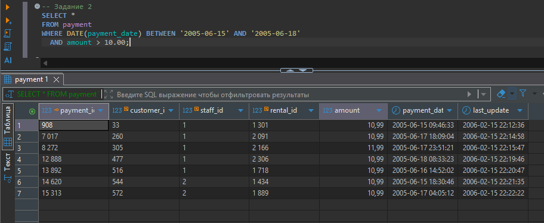
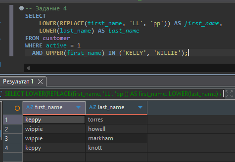

# Домашнее задание к занятию "SQL. Часть 1" - `Конкин Дмитрий`

Задание 1
Получите уникальные названия районов из таблицы с адресами, которые начинаются на “K” и заканчиваются на “a” и не содержат пробелов.
```sql
SELECT DISTINCT district
FROM address
WHERE district LIKE 'K%a'
  AND district NOT LIKE '% %';
  ```


Задание 2
Получите из таблицы платежей за прокат фильмов информацию по платежам, которые выполнялись в промежуток с 15 июня 2005 года по 18 июня 2005 года включительно и стоимость которых превышает 10.00.
```sql
SELECT *
FROM payment
WHERE DATE(payment_date) BETWEEN '2005-06-15' AND '2005-06-18'
  AND amount > 10.00;
  ```


Задание 3
Получите последние пять аренд фильмов.
```sql
SELECT *
FROM rental
ORDER BY rental_date DESC
LIMIT 5;
```


Задание 4
Одним запросом получите активных покупателей, имена которых Kelly или Willie.

Сформируйте вывод в результат таким образом:

все буквы в фамилии и имени из верхнего регистра переведите в нижний регистр,
замените буквы 'll' в именах на 'pp'.

```sql
SELECT
    LOWER(REPLACE(first_name, 'LL', 'pp')) AS first_name,
    LOWER(last_name) AS last_name
FROM customer
WHERE active = 1
  AND UPPER(first_name) IN ('KELLY', 'WILLIE');
```


Задание 5*
Выведите Email каждого покупателя, разделив значение Email на две отдельных колонки: в первой колонке должно быть значение, указанное до @, во второй — значение, указанное после @.
```sql
  SUBSTRING_INDEX(email, '@', 1) AS username,
  SUBSTRING_INDEX(email, '@', -1) AS domain
FROM customer;
```

Задание 6*
Доработайте запрос из предыдущего задания, скорректируйте значения в новых колонках: первая буква должна быть заглавной, остальные — строчными.
```sql
SELECT
  CONCAT(
    UPPER(LEFT(SUBSTRING_INDEX(email, '@', 1), 1)),
    LOWER(SUBSTRING(SUBSTRING_INDEX(email, '@', 1), 2))
  ) AS username_formatted,
  CONCAT(
    UPPER(LEFT(SUBSTRING_INDEX(email, '@', -1), 1)),
    LOWER(SUBSTRING(SUBSTRING_INDEX(email, '@', -1), 2))
  ) AS domain_formatted
FROM customer;
```

